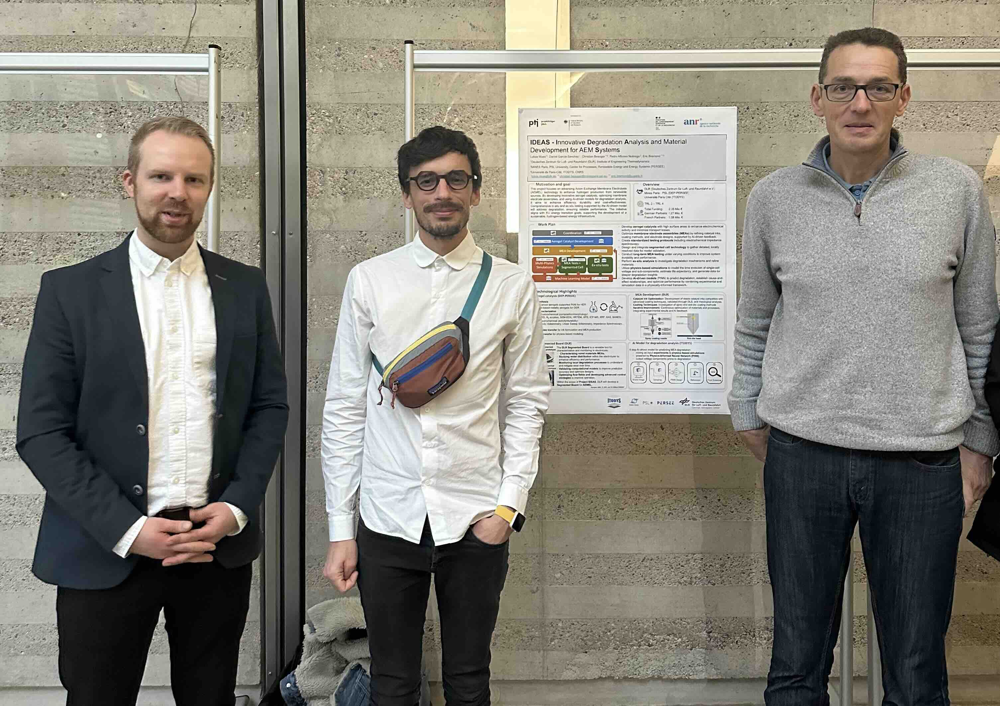

<header>

<!--
  <<< Author notes: Course header >>>
  Include a 1280×640 image, course title in sentence case, and a concise description in emphasis.
  In your repository settings: enable template repository, add your 1280×640 social image, auto delete head branches.
  Add your open source license, GitHub uses MIT license.
-->

# IDEAS - A Franco-German Project Funded by ANR/BMBF

_IDEAS stands for Innovative Degradation Analysis and Material Development for AEM Systems._

</header>

## Outlook

[News](#News)

[The IDEAS Project](#the-ideas-project)

[Partners](#partners)

[Fundings](#fundings)

[Publications](#publications)

[Imprint/Legal Notice](#imprint)

---

## News

_Stay tuned!_

### Dec. 9, 2025 - Kick-Off Meeting / Online

 </img>
 </img>
 </img>

---

### Nov. 29, 2025 - Introduction Symposium / Ambassy of France, Berlin, Germany

 </img>
 </img>
 </img>

---

## The IDEAS Project

This project aims to advance Anion Exchange Membrane Electrolysis (AEMEL) technology, a crucial innovation for enhancing hydrogen production from renewable energy sources. By using the unique properties of aerogel catalysts and integrating computational models, the initiative seeks to significantly improve the efficiency, cost-effectiveness, and durability of AEMEL systems. This technological enhancement is crucial in aligning with the European Union’s ambitious energy transition goals, aiming to establish a robust, sustainable hydrogen-based energy infrastructure.

## Partners

DLR
PERSEE - Mines ParisTech
ITODYS - Université Paris Cité

## Fundings

ANR
BMBF

## Publications

[XX] cite

## Imprint/Legal Notice

Public Relations Contact
ITODYS, Université Paris Cité
Responsible for Website and Public Relations:
Eric Bremond
Address: xxx
Email: xxx

Project Coordinators
Deutsches Zentrum für Luft- und Raumfahrt e. V. (DLR)
Lukas Mues - Project Coordinator Germany

Carl-von-Ossietzky-Str. 15 
26129 Oldenburg, Germany

Email: Lukas.Mues@dlr.de
 
DEP-PERSEE, Mines Paris - PSL
Project Coordinator France
Christian Beauger
Address: xxx
Email: xxx
 
 
Website Hosting
Hosting Service Provider:
GitHub, Inc.
88 Colin P. Kelly Jr St,
San Francisco, CA 94107, USA
https://support.github.com/
 
Funding
This project is funded by the German Federal Ministry of Education and Research (BMBF; Grant number: 03SF0776) and the French National Research Agency (ANR; Grant number: xxx).
 
Disclaimer
The content of this website has been created with the utmost care. However, we cannot guarantee the accuracy, completeness, or timeliness of the information provided.
External links lead to content provided by third parties. The respective provider is solely responsible for their content.
 
Copyright
The content and works published on this website are subject to copyright. Any reproduction, editing, distribution, or use beyond the scope of copyright requires prior written consent from the copyright holder.

<!--
  <<< Author notes: Step 1 >>>
  Choose 3-5 steps for your course.
  The first step is always the hardest, so pick something easy!
  Link to docs.github.com for further explanations.
  Encourage users to open new tabs for steps!

## Step 1: Enable GitHub Pages

_Welcome to GitHub Pages and Jekyll :tada:!_

The first step is to enable GitHub Pages on this [repository](https://docs.github.com/en/get-started/quickstart/github-glossary#repository). When you enable GitHub Pages on a repository, GitHub takes the content that's on the main branch and publishes a website based on its contents.

### :keyboard: Activity: Enable GitHub Pages

1. Open a new browser tab, and work on the steps in your second tab while you read the instructions in this tab.
1. Under your repository name, click **Settings**.
1. Click **Pages** in the **Code and automation** section.
1. Ensure "Deploy from a branch" is selected from the **Source** drop-down menu, and then select `main` from the **Branch** drop-down menu.
1. Click the **Save** button.
1. Wait about _one minute_ then refresh this page (the one you're following instructions from). [GitHub Actions](https://docs.github.com/en/actions) will automatically update to the next step.
   > Turning on GitHub Pages creates a deployment of your repository. GitHub Actions may take up to a minute to respond while waiting for the deployment. Future steps will be about 20 seconds; this step is slower.
   > **Note**: In the **Pages** of **Settings**, the **Visit site** button will appear at the top. Click the button to see your GitHub Pages site.

-->

<footer>

<!--
  <<< Author notes: Footer >>>
  Add a link to get support, GitHub status page, code of conduct, license link.
-->

---

[</img>](https://www.anr.fr) &bull; [</img>](https://www.bmbf.de)

</footer>
